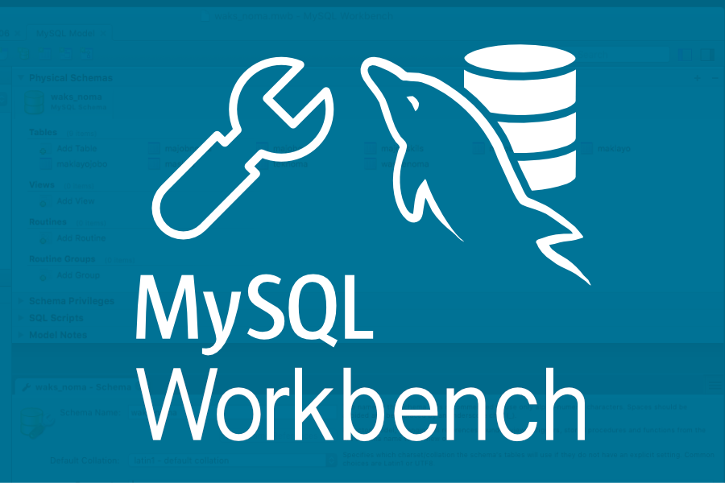

  

###

  

###

  

###

<h1 align="center">Modelagem de Banco de Dados Relacional</h1>

###

<h3 align="left">Entendendo SQL</h3>

###

Após as três fases do Projeto de Modelagem de Banco de Dados Relacional (conceitual, lógico e físico) e sua correta normalização, finilizaremos o curso com noções básicas sobre a Linguagem de Consulta Estruturada, linguagem padrão para trabalhar com banco de dados relacionais.

###

De acordo com a seção <i>"Para saber mais: conhecendo um pouco mais sobre o SQL"</i>, do curso de <strong>Formação de Modelagem de Dados</strong> da Alura, podemos analisar uma breve introdução:

###

<i>"SQL é uma sigla em inglês para Structured Query Language que pode ser livremente traduzida para Linguagem de Consulta Estruturada e é uma linguagem padrão para trabalhar com bancos de dados relacionais.  Ela surgiu nos anos 70 com a IBM, como uma alternativa dos bancos sequenciais, que eram uma lista de tabelas que não tinha relação entre si. Com o passar do tempo sofreu dificuldades para realizar a inclusão, alteração, exclusão de dados e outras necessidades, aumentando a complexidade do manuseio de banco de dados.  Após os bancos sequenciais, vale lembrar o surgimento da álgebra relacional como uma outra alternativa para interagir com bancos de dados relacionais. No entanto, ainda havia barreiras na perpetuação e compreensão de todas as expressões matemáticas usadas em álgebra relacional.  Para entender a melhor maneira de trabalhar dados estruturados, os laboratórios da IBM vieram com as primeiras versões do SQL. Mas quando outras empresas também começaram a trabalhar nisso, um órgão americano de padrões, o American National Standards Institute (ANSI), resolveu unificar todas as iniciativas sobre o movimento do banco de dados SQL promovendo um padrão que, de início, chamou-se de SEQUEL (Structured Query Language) ou seja, Linguagem de Consulta Estruturada em inglês. Já no Brasil, esse termo se popularizou com o nome de SQL.</i>"

###

Para estudar essas noções iniciais da linguagem SQL, foi escolhido como Sistema Gerenciador de Banco de Dados (SGBD) o MySQL, da Oracle. Os instrutores optaram por desenvolver o curso no Sistema Operacional Windows, porém, como todo programador bem sabe (:P), o Sistema Operacional (SO) Linux é a melhor escolha dos bons programadores. O SO que utilizo é o Pop_OS na sua versão 22.04, baseado no Ubuntu. A DigitalOcean apresenta um tutorial excelente para instalação no Ubuntu, podendo ser acessada <a href="https://www.digitalocean.com/community/tutorials/how-to-install-mysql-on-ubuntu-20-04-pt" target="_blank">aqui</a>.

###

A aplicação com interface gráfica utilizada para facilitar a manipulação do SGBD escolhida foi o MySQL Workbench, que tem sua instalação para Linux muito bem explicada no <a href="https://dev.mysql.com/doc/workbench/en/wb-installing-linux.html" target="_blank">site oficial</a>. No fórum de dúvidas do curso, apresenta um <a href="https://cursos.alura.com.br/forum/topico-instalacao-linux-ubuntu-22-04-229037" target="_blank">tutorial</a>, também em inglês.

###

No final da <strong>Formação de Modelagem de Dados</strong>, a Alura apresenta alguns Artigos que resumem os tópicos ensinados.

<ul>
  <li><a href="https://www.alura.com.br/artigos/sql-comandos-basicos" target="_blank">SQL: Comandos básicos</a></li>
  <li><a href="https://www.alura.com.br/artigos/sql-consultas-com-select" target="_blank">SQL: consultas com SELECT</a></li>
  <li><a href="https://www.alura.com.br/artigos/sql-clausulas-update-e-delete" target="_blank">SQL: cláusulas UPDATE e DELETE</a></li>
</ul>

###

Estão disponíveis os scripts de código em linguagem SQL desenvolvidos durante as aulas e, na pasta 'Scripts', os códigos disponibilizados pela Alura.

###

REFERÊNCIAS:

<ul>
  <li><i>PEREIRA, Max Roberto. Banco de Dados e Mineração. Maringá - PR: Unicesumar, 2021. 228 p.</i></li>
  <li><i>SILBERSCHATZ, Abraham; KORTH, S.; SUDARSHAN, Henry F. Sistema de Banco de Dados. 7. ed. Rio de Janeiro: GEN LTC, 2020. 754 p.</i></li>
</ul>

###

<h3 align="left">🛠 Language and tools</h3>

###

  
  
  

###

<h3 align="left">🔥   My Stats :</h3>

###

  

###
